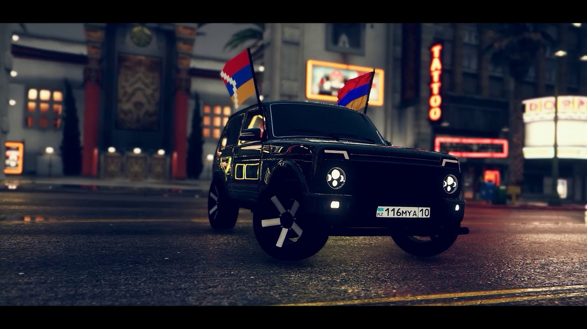
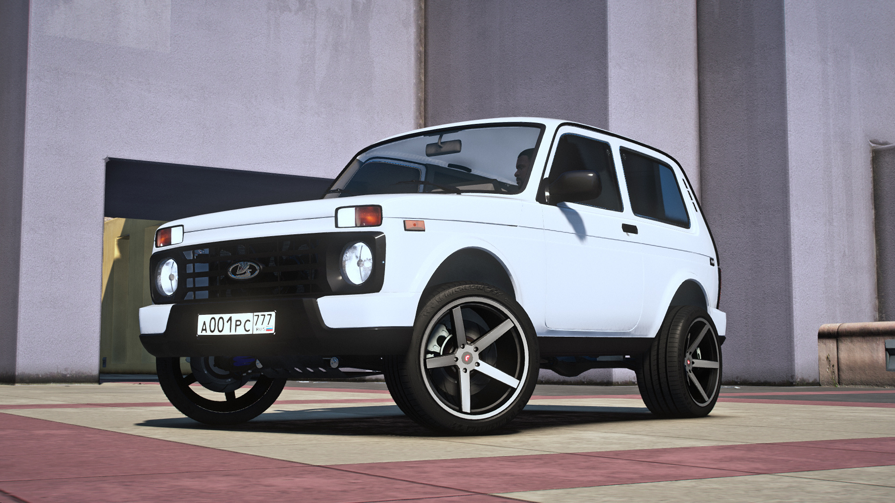

# Ejmiatsin-rp
<!doctype html>
<html data-n-head-ssr lang="ru" data-n-head="%7B%22lang%22:%7B%22ssr%22:%22ru%22%7D%7D">

<head>
    <meta data-n-head="ssr" charset="utf-8">
    <meta data-n-head="ssr" name="viewport" content="width=device-width, initial-scale=1">
    <meta data-n-head="ssr" data-hid="description" name="description" content="Ejmiatsin Role Play - New Project.">
    <meta data-n-head="ssr" name="format-detection" content="telephone=no">
    <meta data-n-head="ssr" data-hid="og:type" name="og:type" content="website">
    <meta data-n-head="ssr" data-hid="og:title" name="og:title" content="Grand Mobile | КРМП РП под Android и IOS">
    <meta data-n-head="ssr" data-hid="og:description" name="og:description" content="Grand Mobile - New Project.">
    <meta data-n-head="ssr" data-hid="og:url" name="og:url" content="https://grnd.gg/">
    <meta data-n-head="ssr" data-hid="og:image" name="og:image" content="https://grnd.gg/images/preview.jpg">
    <meta data-n-head="ssr" data-hid="og:site_name" name="og:site_name" content="Ejmiatsin Role Play">
    <meta data-n-head="ssr" data-hid="og:locale" name="og:locale" content="ru_RU">
    <title>Ejmiatsin Role Play New!</title>
    <link data-n-head="ssr" rel="icon" type="image/x-icon" href="favicon.ico">
    <link data-n-head="ssr" href="https://mc.yandex.ru/metrika/tag.js" rel="preload" as="script">
    
    <link rel="preload" href="8cffc2b.js" as="script">
    <link rel="preload" href="2ead2b0.js" as="script">
    <link rel="preload" href="53e381d.js" as="script">
    <link rel="preload" href="419fbbc.js" as="script">
    <link rel="preload" href="e8a6512.js" as="script">
    
    
    <noscript>

</noscript>
    <meta name="lava" content="ouUCai9Ksjr0YfPF8Z4pXdQqDOVIzb1tmRA62vNWMh35Gcxe">
</head>

<body>
    

        <!---->
        

            

                <header>
                    <!---->
                    

                        <a href="/" aria-current="page" class="nuxt-link-exact-active nuxt-link-active">
                            

                        </a>
                        <nav>
                            <ul class="landing-header-menu">
                                <li><svg xmlns="https://www.youtube.com/watch?v=lY8xuCE1oZc&list=RDlY8xuCE1oZc&index=1" xmlns:xlink="https://www.youtube.com/watch?v=lY8xuCE1oZc&list=RDlY8xuCE1oZc&index=1" width="22" height="23" viewBox="0 0 22 23"><image id="wallet" width="22" height="23" xlink:href="data:img/png;base64,iVBORw0KGgoAAAANSUhEUgAAABYAAAAXCAYAAAAP6L+eAAABf0lEQVQ4jbWVsUoDQRCGvxwq2mjrAyiI2EsKEbRSVLSz9xEEKyv1XaxtxMY6hWIvpvIRLCSJlxvZMKuTdeeSKC78N9yx9+3Mv7N3iMhvVIhIU0QuRKQlIhspoxEuY45pYAvYB3aAeaCregCO7eSpEbA5YBc4BPb0/kPVA/qqVaAJtOrAC8CBwgJ0FhAFBGBlgFYnHngdOAK2tewwnjVGWGkyjllHBdYS0A4vTOLxRKP4F6qmHzy8UgsamTmVll0aK3qJunzHJ+B6SqGnzsLiwAKg48TFMKfQTL1RJUo7oXTiSuGUH7P1YOUIeFW3eTbbXN/m4H2dLx5YRthQOtl/yTvSng250h+BG+DdJNHJgdNs6+BvwKV2ytDIWSE15ed8zR7dXMY5b1NgvJ8BzoBbtUJUP6yoK9/rhDVgWe2IH6fX1ArPhnE6oTJxqN3GheYqsdCgweZJYsO48HSR+N7A5wC+/+PxtdAIbofNO9cHm+b3k/tD2C+b3aiouNALcPcJDfl1/gagHEkAAAAASUVORK5CYII="/></svg>Համալրում</li>
                                <li><svg xmlns="http://www.w3.org/2000/svg" xmlns:xlink="http://www.w3.org/1999/xlink" width="22" height="21" viewBox="0 0 22 21"><image id="heart" width="22" height="21" xlink:href="data:img/png;base64,iVBORw0KGgoAAAANSUhEUgAAABYAAAAVCAYAAABCIB6VAAABl0lEQVQ4ja2VzStEYRTGfzNRROwm/AFKyU5W1JQFGwt72VjaUPLxB9hYYYOVUIqNhQXZYkpYsZBCVr5qfCzGMObo1Ll657ruTOY+9fTeW+f9vc97up0bExEcNQFDQLu9HwFLwD2FSgADQBuQA06BDeDxp0rB5kERychvpUUk6dR1ici1iNyJyK2IXIrImYikRKTXq/MS9wFbQIxgpS2dFqeAauDDnAXenXVCayqAKmAhBKqqB0aBPFBrwC9rQ8551nUYOFFwP9AYAhUD6q0+bbNrP7wO6FBwdwjUA+umBuf6QcCcc1hrHGguIW0+IOlfcHUibj0rltYPDkurrowXfHvRpFW/KPgg4rTqCwWvGCSqtOpDBV8BqxGm3Qee4gYac3pdTtpnYFMhHvjBhkq+jLT6vgi8uWDVLjBSRto14NyDuWDVHDD1j7TrwJ4L8oNVM8B4wFwIgmvNMrDth/gHvaseYNYOz/rGo/rVQhwHbQ4Dq1oMrn8MF34DTNsaqGJgVQ0wCSQNvAPMA5mwTaWAPXVafw+LVgLfMIpZMu5i1gcAAAAASUVORK5CYII="/></svg>Աջակցություն</li>
                                <li><svg width="20" height="20" viewBox="0 0 20 20" fill="none" xmlns="http://www.w3.org/2000/svg"><path d="M1 17H13V19H1V17Z" fill="url(#paint0_linear_1806_333)"/><path d="M1 13H19V15H1V13Z" fill="url(#paint1_linear_1806_333)"/><path d="M1 2C1 1.44772 1.44772 1 2 1H18C18.5523 1 19 1.44772 19 2V10C19 10.5523 18.5523 11 18 11H2C1.44772 11 1 10.5523 1 10V2Z" fill="url(#paint2_linear_1806_333)"/><defs><linearGradient id="paint0_linear_1806_333" x1="1" y1="10" x2="19" y2="10" gradientUnits="userSpaceOnUse"><stop stop-color="white"/><stop offset="1" stop-color="white" stop-opacity="0.67"/></linearGradient><linearGradient id="paint1_linear_1806_333" x1="1" y1="10" x2="19" y2="10" gradientUnits="userSpaceOnUse"><stop stop-color="white"/><stop offset="1" stop-color="white" stop-opacity="0.67"/></linearGradient><linearGradient id="paint2_linear_1806_333" x1="1" y1="10" x2="19" y2="10" gradientUnits="userSpaceOnUse"><stop stop-color="white"/><stop offset="1" stop-color="white" stop-opacity="0.67"/></linearGradient></defs></svg>Նորություններ</li>
                            </ul>
                            <svg width="43" height="32" viewBox="0 0 43 32" fill="none" xmlns="http://www.w3.org/2000/svg" class="burger-click"><path fill-rule="evenodd" clip-rule="evenodd" d="M0 31.999V28.999H42.999V31.999H0ZM0 14.999H42.999V17.999H0V14.999ZM0 0H42.999V2.999H0V0Z" fill="white"></path></svg></nav>
                    

                    <!---->
                </header>
                <main class="landing-main">
                    <section id="section-1">
                        
ՔՈ ԱՇԽԱՐՀԸ Դեպի համակարգիչ

                        <a href="#" class="crmp">
                            

                                ԲԵՌՆԵԼ Launcher
                               

                        </a>
                        <a href="#" class="last-device">
                            հասանելի է appstore-ում
                <svg xmlns="http://www.w3.org/2000/svg" width="24" height="24" viewBox="0 0 24 24" fill="none"><path fill-rule="evenodd" clip-rule="evenodd" d="M15.6851 3.83145C16.56 2.81746 17.1497 1.40518 16.9883 0C15.7276 0.048 14.2023 0.805376 13.2983 1.81816C12.4865 2.71695 11.7779 4.15308 11.9684 5.53066C13.3747 5.63505 14.8102 4.84662 15.6851 3.83145ZM18.8388 12.75C18.874 16.3824 22.1636 17.5907 22.2 17.6063C22.1734 17.6915 21.6746 19.3279 20.4673 21.0199C19.4225 22.4815 18.3389 23.9372 16.6316 23.9684C14.9546 23.9984 14.4146 23.0156 12.4962 23.0156C10.579 23.0156 9.97954 23.937 8.39237 23.9982C6.74452 24.057 5.48861 22.4169 4.43657 20.9602C2.28393 17.9806 0.639727 12.5401 2.84818 8.86816C3.94513 7.04539 5.90482 5.88935 8.03319 5.86055C9.6507 5.83055 11.1784 6.90352 12.1674 6.90352C13.1563 6.90352 15.0129 5.61353 16.9641 5.80313C17.7807 5.83553 20.0741 6.11863 21.546 8.18379C21.4271 8.25459 18.8097 9.71405 18.8388 12.75Z" fill="white"></path></svg></a>
                        

                            
<svg xmlns="http://www.w3.org/2000/svg" xmlns:xlink="http://www.w3.org/1999/xlink" width="34" height="31" viewBox="0 0 34 31"><image id="Icon" width="34" height="31" xlink:href="data:img/png;base64,iVBORw0KGgoAAAANSUhEUgAAACIAAAAfCAYAAACCox+xAAACmklEQVRYhe1XQUtUURT+ruU4Y65ElFDGheEirMBo014hoXF2/QBxEy7EX5CLoF0R2CZc5sqF1EIDF4JLE6JAXeiihbQQQpCsHOyLK+fFmeN9033DzKz6YJjHOef7znffm3veHdQDkn0kn5HcI3kmnz2J9dUlmhUkJ0meMB0+N9lsE2Mkz2uYSOBrxrJouwwmCgAOAFxX4X0AK3JdBnBD5b4CGHLO/chiKMbItFn1G5LtKt8uMY3phpqQRsuqwRHJzkBNp+QSLMfqt9VonCdZJNkloaJKbzrnTi1HYpsqVBStLtHKRxsheZ/kGoATAF/8N8lP/nmrskKNxenckHC11prvUYN/YWImclf8JNkf4PdLLmZXzaSZGI8Q0PhAclDxByWWBeMJ3ykhfwtvKW9vAbwDcBPAYwAdAf9nALbk+h6AXKDmF4BXAHYAPARQUrnPzrnb+m4Mm1UsmrtVyrhSjZLRWjT5YZ2cMMnRwKM7rMPEYUBn1NRMQO0amvqCIfu60Nb7LdP2QK4t8sJN1a7qTXLAuPRbLKfysybvf/VPSfaqml6J2V03q2pyoq0xYG/ZhinYJfmS5GrARDmw+kSnHDCzKlq7Jr4REpiv/bj/YiHNhNJaiNSat8S5SKLHSISRkQx6c57jSN4BsA3gSkDzO4CraoZUnHOhWREy42dM8nb21xUA1wKl5wDuesKScficZLcSfKJyxzEmhHeseC9UvFt6aCzBvLbXA4INNaLy6yp/5Pd4j8q/j23UAOhePXbYVFpopKpX6sGo1fhvxKJN/hIk+NjC3rrXvh9WDwD4Y/+2c+7y7G8SfC+Sjy6GGfD6n12aNUcsYn4j/qiXwJ/GY6Frv2XghSEn8x2SpySnMvCmhOO5l078VQDwB9Vi7p55O9iuAAAAAElFTkSuQmCC"></image></svg>                                0
                                
Հիմաառցանց

                            

                        

                        
ԻՆՉ Է ՍՊԱՍՈՒՄ ՔԵԶ

                    </section>
                    <section id="section-2">
                        

                            
ԱՆՀԱՎԱՆԱԿԱՆ ՆՈՐԱՃ
 
                            
Ստեղծեք ձեր սեփական ոճը ամենանորաձև ապրանքանիշերի ավելի քան 300 մոդելներից

                        

                        

                            
ԱՌԱՆՑ ՍԱՀՄԱՆՆԵՐԻ

                            
Ձեր առջև հսկայական մեգապոլիս է՝ բարձր երկնաքերերով և գեղատեսիլ շրջապատով. Փորձեք նվաճել նրան!

                        

                        

                            
ՇԱՏ ԱՐԱԳ

                            
Ընտրեք մեքենա հարյուրավոր տարբեր տարբերակներից՝ խորհրդային փոքր մեքենաներից մինչև ժամանակակից սպորտային մեքենաներ
 

                    </section>
                    <section id="section-3">
                        

                            

                                
ՂԵԿԱՎԱՐԵՔ ՁԵՐ ԲԻԶՆԵՍԸ

                                
ԴԱՐՁԵՔ ՄԵԾ ՇԵՖ ԵՎ ՎԱՍՏԵՔ ԱՇԽԱՐՀԻ ԲՈԼՈՐ ՓՈՂԸ! ՀԱՂԹԵՔ ԻՇԽԱՆՈՒԹՅՈՒՆ ԵՎ ՀԱՐԳԱՆՔ!

                            

                            

                        

                        

                    </section>
                    <section id="section-4">
                        
<a href="/news">Նորություններ</a>

                        

                            

                                
Ejmiatsin Role Play: ԲԱՑՈՒՄ 1 ՍԵՐՎԵՐ

                                
Ejmiatsin Role Play   Բացումը շուտով!

                                
                            

                            

                                
Ejmiatsin Role Play: ԳԱՐՆԱՅԻՆ ԹԱՐՄԱՑՈՒՄ

                                
Գարնանային վերջին թարմացումն արդեն Էջմիածնի Role Play-ում է. ծանոթացեք ճանապարհային կառավարման նոր համակարգին, հարմարեցված թյունինգի համակարգին, նորացված մեքենաների ցուցասրահին և շատ նորաձև մաշկերի՝ նորաձև աքսեսուարներով!

                                
                            

                            

                                
Ejmiatsin Role Play: ՀԱՄԱԳՈՐԾԱԿՑՈՒԹՅՈՒՆ ԼՐԱՏՎԱՄԻՋՈՑՆԵՐԻ ՀԵՏ

                                
Լավ լուր! Մենք բաց ենք նոր տաղանդների հետ փոխշահավետ համագործակցության համար։ Դուք պետք է հայտ ներկայացնեք՝ օգտագործելով հղումը — https://vk.me/grandrpmedia

                                
                            

                        

                    </section>
                    <section id="section-5">
                        

                            

                               
                                <a href="#" target="_blank">
                                    
400+ 

                                </a>
                                <a href="#" target="_blank">
                                    

                                </a>
                                <a href="#" target="_blank">
                                    
363+ 

                                </a>
                            

                            

                        

                        

                            
                            

                                <a href="https://vk.com/grandrprussia" target="_blank">
                                    
400 000+ ПОДПИСЧИКОВ

                                </a>
                                <a href="https://www.youtube.com/channel/UCXBEpDlLUCwo-0O0gmW0T-g" target="_blank">
                                    
35 000+ ПОДПИСЧИКОВ

                                </a>
                                <a href="https://discord.gg/grnd" target="_blank">
                                    
30 000+ ПОДПИСЧИКОВ

                                </a>
                            

                        

                    </section>
                </main>
                <footer class="landing-footer">
                    

                        

                            

                            

                                <ul>
                                    <li><a href="#">ԱՋԱԿՑՈՒԹՅՈՒՆ</a></li>
                                    <li><a href="#">ՕԳՏՎԵԼՈՒ ԿԱՆՈՆՆԵՐ</a></li>
                                    <li><a href="#">ԳԱՂՏՆԻՈՒԹՅԱՆ ՔԱՂԱՔԱԿԱՆՈՒԹՅՈՒՆ</a></li>
                                </ul>
                                

                                    

                                        
ՀԱՄԱԳՈՐԾԱԿՑՈՒԹՅՈՒՆ ԼՐԱՏՎԱՄԻՋՈՑՆԵՐԻ ՀԵՏ
 <a href="https://vk.com/grandrpmedia" class="lik">VK.COM/EJMIATSINRPMEDIA</a>

                                    
                                                                                 

                                

                            

                        

                    

                    

                        

                            
ՀԱՄԱԳՈՐԾԱԿՑՈՒԹՅՈՒՆ ԼՐԱՏՎԱՄԻՋՈՑՆԵՐԻ ՀԵՏ
 <a href="https://vk.com/grandrpmedia" class="lik">VK.COM/EJMIATSINRPMEDIA</a>

                    

                </footer>
                <notifications group="foo" position="bottom left" width="100%"></notifications>
            

        

    

    
    
    
    
    
    
    
</body>

</html>
